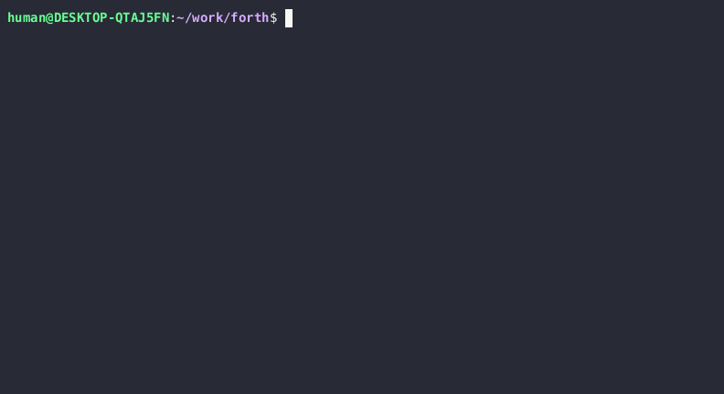

# forth

simple itc forth



# TCO

c compiler must enable tail call optimiztion.

# number

now only support hex number input:

```
0123456789ABCDEF
```

# add word

```
: star 2A emit ;
```

# use branch

```
: dollar 24 emit ;
: iftest if star exit then dollar ;
```

```
true iftest *
false iftest $
```

# use loop

```
: stars dup if begin star 1- dup 0= until then drop ;
```

```
0 stars
1 stars *
5 stars *****
```

# todo

1. multitask word
2. graphic support (linuxfb)
3. decimal number convert support
